# Grooming OS — Architecture & Data Flow Diagrams

> All diagrams use [Mermaid](https://mermaid.js.org/) syntax and render natively on GitHub.

---

## 1. High-Level System Architecture

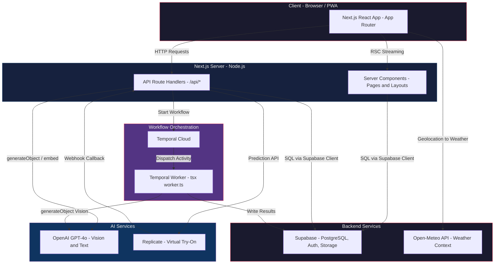

---

## 2. Application Route Map

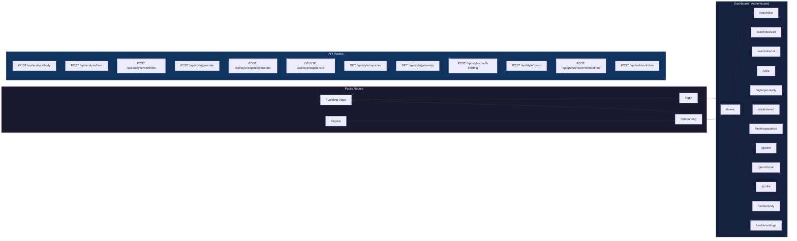

---

## 3. Database Entity-Relationship Diagram

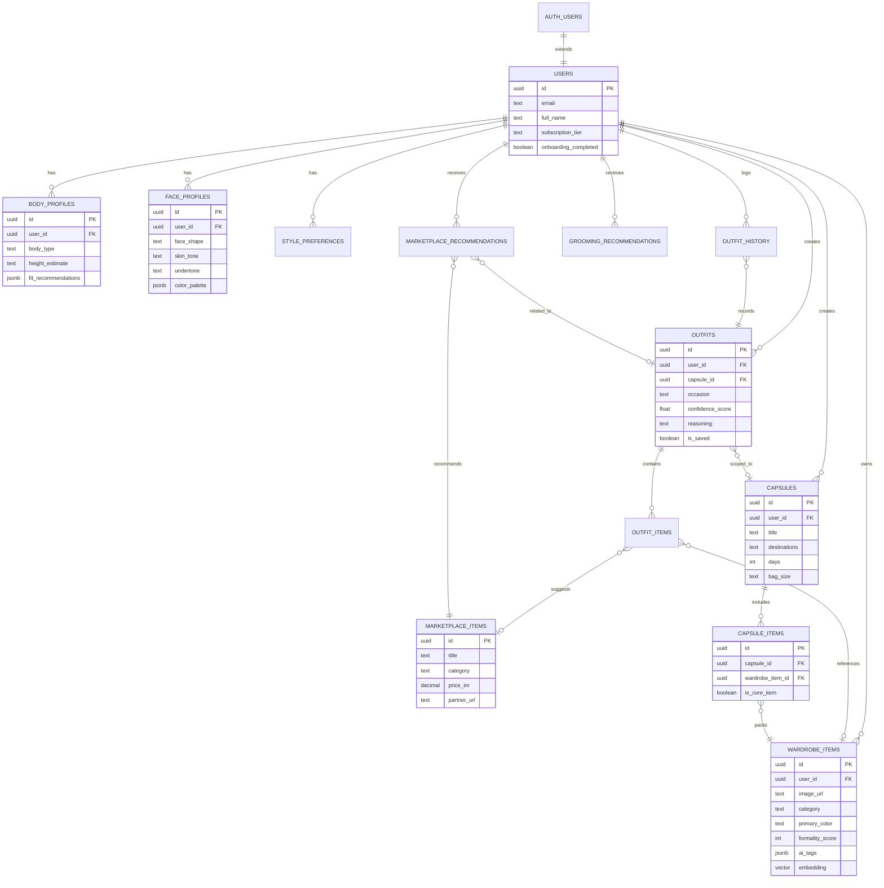

---

## 4. DFD Level 0 — Context Diagram

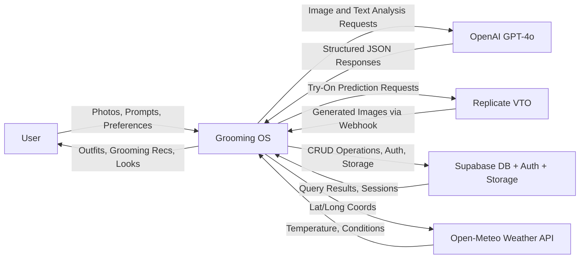

---

## 5. DFD Level 1 — Major Processes

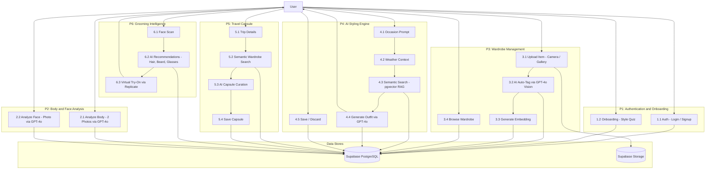

---

## 6. DFD Level 2 — Wardrobe Upload Flow

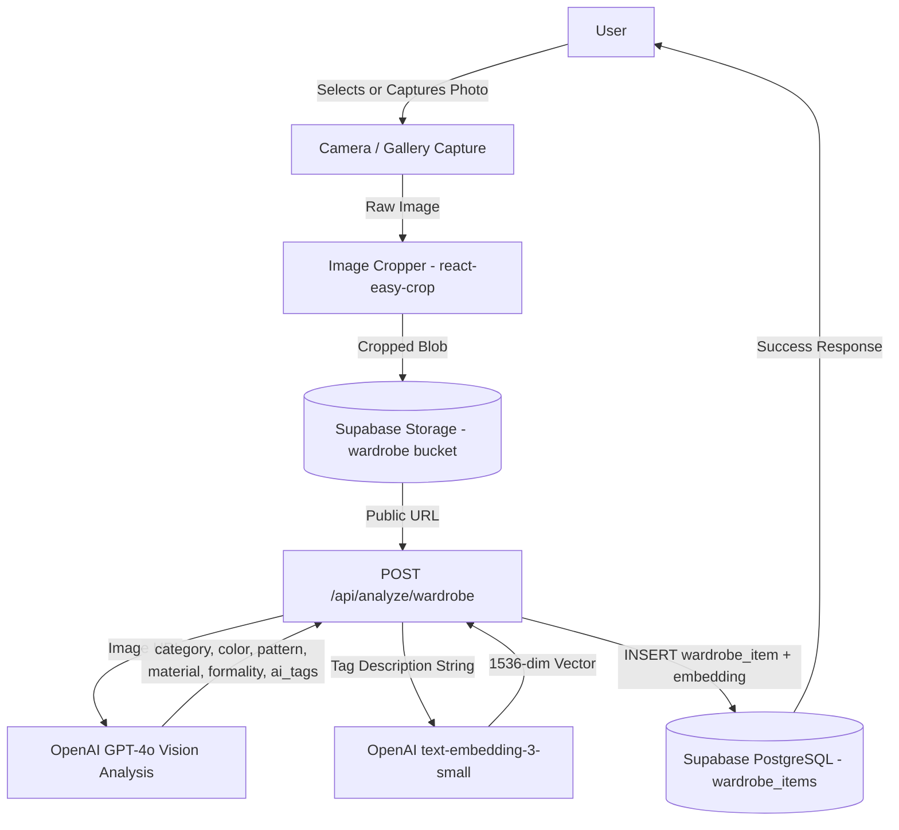

---

## 7. DFD Level 2 — Outfit Generation Flow

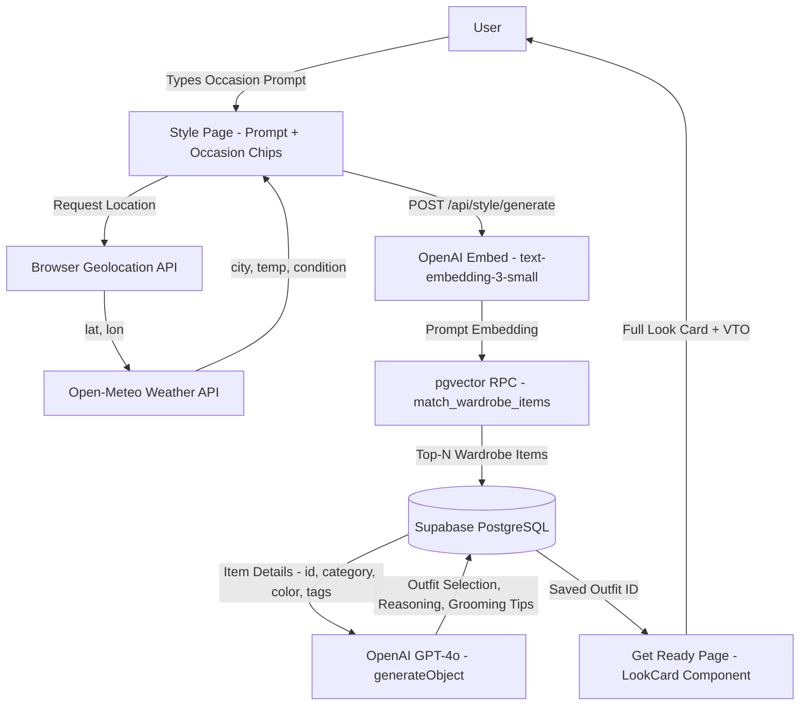

---

## 8. DFD Level 2 — Grooming and Virtual Try-On Flow

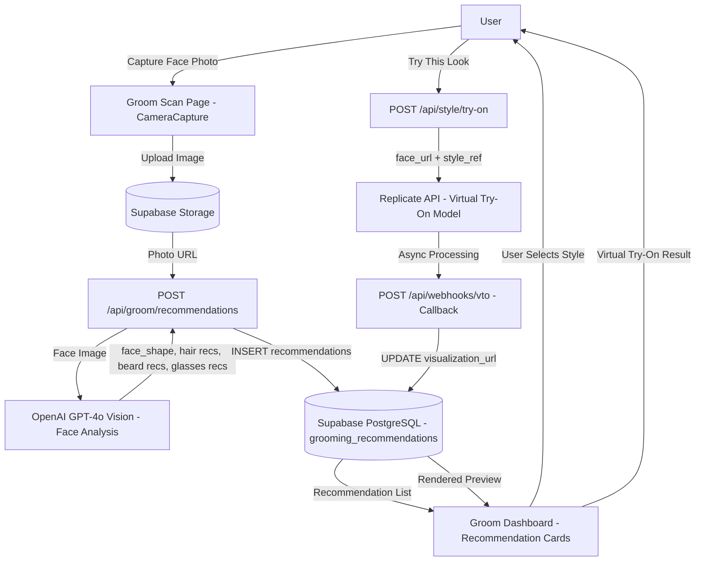

---

## 9. Component Hierarchy Diagram

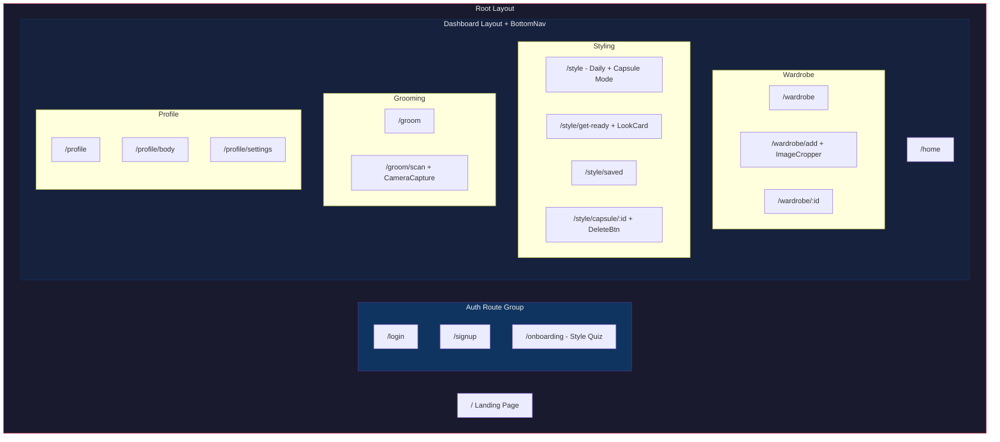

---

## 10. Temporal Workflow Architecture

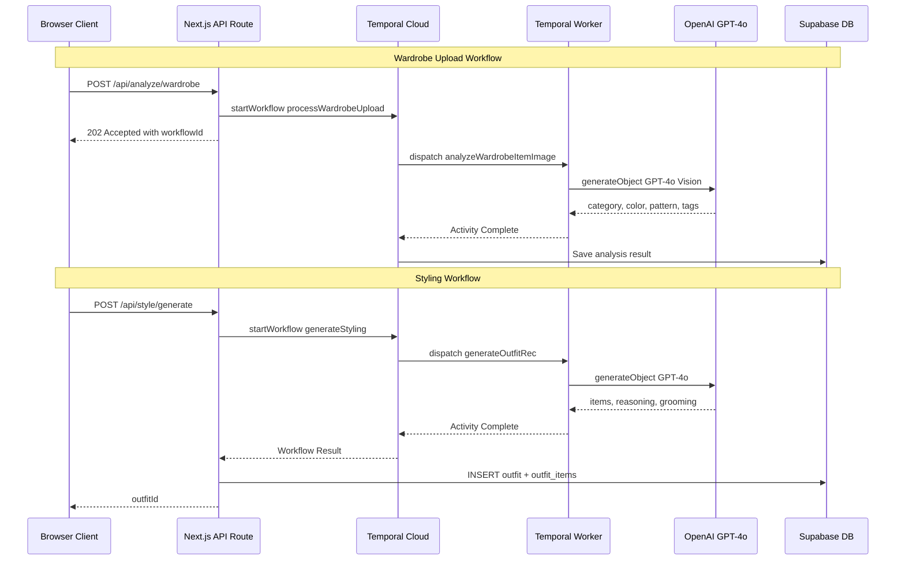

---

## 11. Authentication and Session Flow

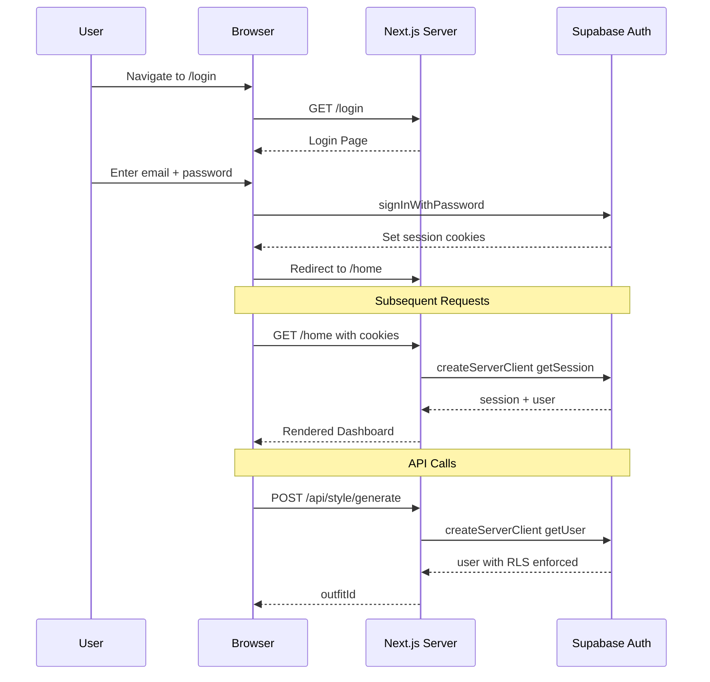

---

## 12. Deployment Topology

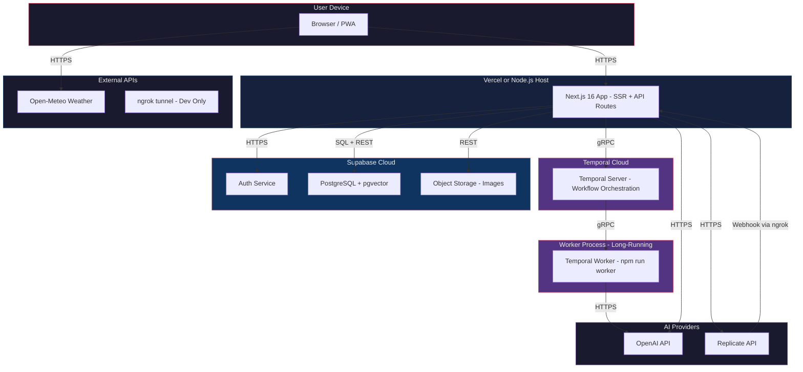
